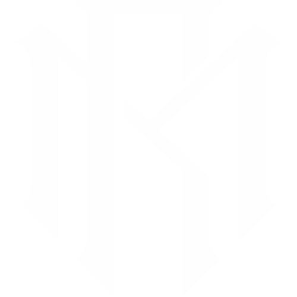

<!-- PROJECT LOGO -->
<a href="LICENSE" target="_blank">
    
</a>
<br />
<div align="center">
  <a href="https://github.com/RaulMaya/React-Portfolio">
    
  </a>

  <h2 align="center">React Portfolio: Raúl Maya</h2>
  <h4 align="center">React.js - Front End Application</h4>

<br/>
<p align="center">
    <a href="https://vitejs.dev/guide/" target="_blank">
        
    </a>
    <a href="https://react.dev/learn" target="_blank">
        
    </a>
    <a href="https://nodejs.org/en/docs/" target="_blank">
        
    </a>
    <a href="https://docs.insomnia.rest/" target="_blank">
        
    </a>
</p>
<br/>

<p align="center">
Create a portfolio using your new React skills, which will help set you apart from other developers whose portfolios don’t use the latest technologies. 
    <br />
    <br />
    <a href="https://github.com/RaulMaya/React-Portfolio">Repository</a>    
    ·
    <a href="https://www.youtube.com/watch?v=Zyc3FdvM99g">Deployment</a>
    ·
    <a href="https://www.linkedin.com/in/raul-maya/">My LinkedIn</a>

  </p>
</div>

### Content Table

- [About](#about)
- [Usage](#usage)
- [Installation](#installation)
- [Video](#video)
- [License](#license)
- [Contact](#contact)

<br>

### About

<p>Overall, this React application provides a structure for managing and rendering different pages/components within a portfolio application, allowing users to navigate through different sections of the portfolio..</p>

<p>In the JSX code, the PortfolioContainer component renders a <code>< div ></code> element that contains three child components: Navbar, renderPage() (the result of the renderPage function), and Footer. The Navbar component receives the currentPage state and the handlePageChange function as props.</p>

<br>

### Usage

<p>A web developer online portfolio serves as a showcase of a web developer's skills, experience, and past projects. It is a collection of their best work that demonstrates their abilities and expertise in web development. The primary purpose of a web developer online portfolio is to impress potential clients, employers, or collaborators by highlighting the developer's capabilities and demonstrating the quality of their work.</p>

<br>

### Installation

```
git clone git@github.com:RaulMaya/React-Portfolio.git
npm i
npm run dev
```

<br>

### Deployment

<a href="https://raulmaya.github.io/React-Portfolio/">

</a>
 
<br>

### License

> You can check out the full license [here](https://github.com/RaulMaya/Social-Network-API/blob/master/LICENSE)
> This project is licensed under the terms of the **MIT** license.

<br>

### Contact

- Name: Raul Maya Salazar
- Phone: +52 833 159 7006
- E-mail: raulmayas20@gmail.com
- GitHub: https://github.com/RaulMaya
- LinkedIn: https://www.linkedin.com/in/raul-maya/

<p align="right">(<a href="#top">back to top</a>)</p>
